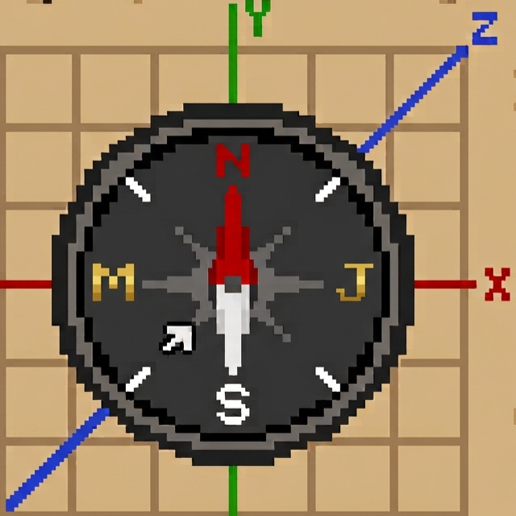

  

  # MJCoordinates

  **A lightweight, accurate actionbar coordinate display datapack for Minecraft.**

---

## 📖 Overview

**MJCoordinates** is a clean, performance-friendly Minecraft datapack that displays your real-time **X, Y, Z coordinates**, the current **world day count**, and your **cardinal facing direction** directly on the action bar.

---

## ✨ Features

* 📍 **Real-time Actionbar HUD:** Shows X, Y, Z, world day count, and facing direction without cluttering your screen.
* 🧭 **Full 360° Compass:** Accurately maps player yaw angles (`-180°` to `180°`) across all 8 cardinal directions (`N`, `NE`, `E`, `SE`, `S`, `SW`, `W`, `NW`).
* ⚡ **Optimized:** Runs efficiently every tick with minimal score calculations and single-tick tag initialization.

---

## 🎯 Supported Versions

* **Minecraft Java Version:** 1.21.9 – 1.26.2
* **Older Version Support:** coming soon...

---

## 📄 License

This project is open-source and free to use or modify for your own worlds and servers.